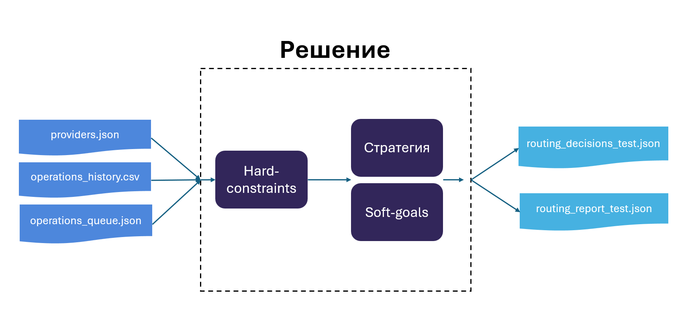
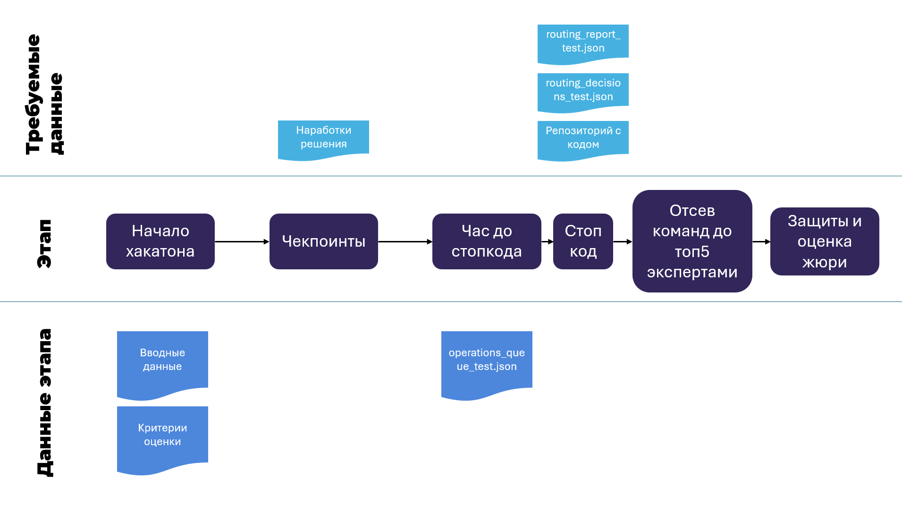
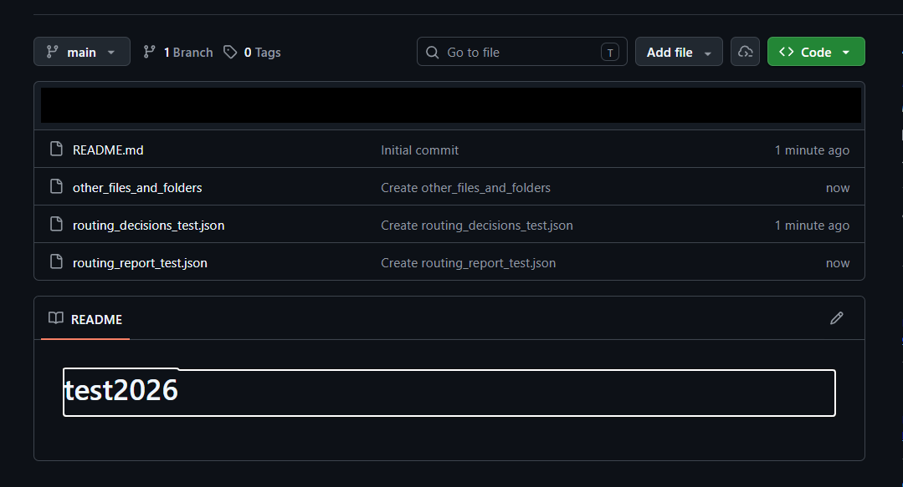

# Задача 2. Умный роутинг выплат

Расшифровка `docs/tz.docx` (оригинал от организаторов). Текст сохранён дословно,
таблицы восстановлены из плоского docx-текста, картинки вынесены в `docs/media/`.

## Полное описание

Вам необходимо разработать механизм умного распределения выплат между несколькими
платёжными партнерами. Для каждой новой операции система должна выбирать наиболее
подходящего партнера с учетом стратегии и правил. Если выбранный партнёр не может
провести выплату или отказывает в обработке, необходимо автоматически перейти к
следующему подходящему варианту.

Для каждой выплаты необходимо сохранять понятное объяснение принятого решения:
какие варианты рассматривались, почему был выбран конкретный партнер и по каким
причинам остальные были исключены. Также на основе истории операций нужно
оценивать качество текущего роутинга и давать рекомендации.



## Вводные данные

Все файлы в папке `data/`:

| Файл | Описание |
|---|---|
| `providers.json` | Состояние провайдеров на момент симуляции (лимиты, метрики, банки) |
| `operations_history.csv` | 100 исторических решений роутинга заявок. Их можно использовать для анализа конверсии провайдера, долей count/volume и калибровки |
| `operations_queue.json` | пример 10 заявок для роута |
| `sample_routing_decisions.json` | Пример формата, в котором нужно отдать ответ для автопроверки |
| `validate.rb` | Скрипт автопроверки, именно им будет проверяться ваш итоговый `routing_decisions.json` (для `routing_decisions_test.json` будет схожий скрипт) |

> В выданной папке файлы называются `operations_queue_10.json` и `validate_10.rb`;
> плюс есть не упомянутый в таблице `reference_decisions.json` — эталон, который
> читает валидатор.

### Формат результата роутинга

```json
[
  {
    "operation_id": "op_103",
    "selected_provider": "quickpay",
    "attempts": [
      {
        "provider": "vipay",
        "decision": "skipped",
        "reason": "amount_exceeds_limit",
        "details": "150000 > limit_amount_max 100000"
      },
      {
        "provider": "payflow",
        "decision": "skipped",
        "reason": "amount_exceeds_limit",
        "details": "150000 > limit_amount_max 50000"
      },
      {
        "provider": "quickpay",
        "decision": "selected",
        "reason": "only_eligible_provider"
      }
    ],
    "simulated_result": "approved",
    "latency_sec": 28
  }
]
```

### Формат провайдера

Ключевые поля из `providers.json`:

| Поле | Описание |
|---|---|
| `traffic_percentage` | Целевая доля по количеству заявок |
| `limit_amount_min/max` | Диапазон суммы чека |
| `daily_amount_limit` / `daily_approved_amount` | Дневной max / текущий оборот |
| `in_progress_count_limit` / `in_progress_count` | Лимит одновременных заявок |
| `in_progress_amount_limit` / `in_progress_amount` | Лимит суммы in-progress |
| `available_requisites` | Свободные реквизиты/терминалы |
| `banks` / `exclude_banks` | Фильтр по банку |
| `conversion_24h` | Конверсия за 24 часа |
| `provider_margin_pct` / `merchant_margin_pct` | Маржа |

Поля, которые командам полезно добавить самим (вывести из истории / поставить
субъективные значения, приближенные к реальности):

| Поле | Критерий |
|---|---|
| `volume_share_pct` | % от объёма |
| `priority` | очередь в каскаде |
| `requests_per_minute_limit` | интенсивность |
| `daily_turnover_min` | фин. обязательство «не менее X ₽/сутки» |
| `daily_turnover_max` | фин. обязательство «не более X ₽/сутки» (или использовать `daily_amount_limit`) |

## Стратегии распределения

Решение участников должно уметь работать по нескольким стратегиям роутинга,
а также по их комбинации.

| № | Стратегия | Критерий | Что означает | Пример настройки |
|---|---|---|---|---|
| 1 | Процент от количества заявок | Доля по числу операций | | vipay 40%, payflow 35%, quickpay 25% |
| 2 | Процент от объёма | Доля по сумме (рубли), а не по count | | vipay 50% оборота, остальные 50% |
| 3 | Очередь в каскаде | Последовательный обход по `priority` (как депозиты в production) | | сначала vipay, при отказе — payflow, затем quickpay |
| 4 | По сумме чека | Маршрутизация по диапазону суммы заявки | | 500–50 000 → payflow; 50 001–100 000 → vipay; >100 000 → quickpay |
| 5 | Приоритизация по конверсии | Предпочитать провайдеров с более высокой `conversion_24h` | | soft-boost веса или порядок кандидатов |
| 6 | По интенсивности | Rate limit на терминал/провайдера | | не более 7 заявок/мин на терминал A, 15/мин на терминал B |
| 7 | По фин. обязательствам | Min/max оборот в сутки, если гейт выдан на условиях по обороту | | не менее 2 000 000 ₽/сутки на payflow; не более 5 000 000 ₽ на vipay |

## Правила роутинга

### Hard-constraints

Hard-constraints — это условия допуска провайдера к роутингу. Они отвечают на
вопрос: «Можно ли вообще отправить эту заявку этому провайдеру?». Если хотя бы
одно жёсткое условие не выполнено, провайдер исключается из рассмотрения
независимо от стратегии.

Эти проверки нельзя нарушать независимо от выбранной стратегии:

| Проверка | Условие пропуска |
|---|---|
| Статус провайдера | `status != "active"` |
| Диапазон суммы чека | `amount` вне `limit_amount_min/max` |
| Дневной max | `daily_approved_amount + amount > daily_amount_limit` |
| In-progress count/amount | превышение лимитов одновременных заявок |
| Банковский фильтр | банк не подходит под `banks` / `exclude_banks` |
| Маржа | `provider_margin_pct > merchant_margin_pct` (если нет `allow_negative_agreement`) |
| Реквизиты | `available_requisites == 0` |
| Интенсивность | превышен `requests_per_minute_limit` |

**Fallback:** при отказе/таймауте — исключить провайдера из пула и выбрать
следующего. Если пул пуст — fallback на `spacepayments` (self-provider).

**Обновление метрик:** после каждой заявки обновлять загрузку, оборот, счётчики
интенсивности выбранного провайдера.

### Soft-goals

Soft-goals — это цели распределения заявок между провайдерами. Они отвечают на
вопрос: «Кого предпочтительнее выбрать из провайдеров, которые уже прошли
Hard-constraints?».

Нарушение soft-goal не запрещает использовать провайдера. Вместо этого система
повышает или понижает его приоритет в зависимости от того, насколько текущее
состояние отклоняется от целевого.

| Soft-goal | Поле | Как влияет на выбор |
|---|---|---|
| Целевая доля по количеству заявок | `traffic_percentage` | Если провайдер получает меньше своей целевой доли — приоритет повышается; если больше — понижается |
| Целевая доля по объёму | `volume_share_pct` | Аналогично, но считается доля от денежного объёма |
| Конверсия | `conversion_24h` | Более высокая конверсия может повышать приоритет, если стратегия учитывает конверсию |
| Позиция в каскаде | `priority` | Определяет очередность/предпочтительность провайдера при каскадной или priority-стратегии |
| Минимальный дневной оборот | `daily_turnover_min` | Если минимум ещё не набран — провайдеру можно повышать приоритет |

### Согласование правил

Критерии могут конфликтовать. Решение должно:

- разделять hard-constraints и soft-goals;
- применять hard-фильтры до выбора стратегии;
- внутри допустимого пула выбирать кандидата по активной стратегии (или комбинации);
- при конфликте soft-целей — использовать явный приоритет политик и фиксировать это в `attempts` / отчёте;
- при отказе выбранного провайдера — fallback на следующего подходящего без нарушения hard-ограничений.

Пример конфликта:

- Цель: 40% заявок на vipay.
- Факт: vipay почти исчерпал дневной max, а на payflow висит обязательство «не менее 2 млн ₽/сутки».
- Ожидание: роутер снижает долю vipay, дотягивает оборот payflow, объясняет это в аналитике.

## Процесс разработки и оценки



- После начала хакатона команды получат вводные данные кейса и критерии оценки.
- **За час до стопкода** командам будет выдан `operations_queue_test.json`, команды
  должны его обработать и предоставить ожидаемый минимальный результат.
- В течение хакатона у команды 3 чекпоинта (встречи с экспертами); по итогам всех
  трёх эксперты выставляют оценки (максимум 100 баллов) — так формируется топ-5
  команд, допущенных до защит.
- На защитах команды оценивает жюри по своим критериям; суммарная оценка =
  баллы технического жюри + баллы отраслевого жюри (максимум 160 баллов).
- По итогам формируется лидерборд, отбираются топ-3 призёра.

## Ограничения

- На кейсе нельзя использовать проприетарные технологии и решения с закрытым исходным кодом.
- **Большинство кода внутри репозитория должно быть написано на Ruby.**
- **Запрещено использование нейросетей внутри проекта.**

За нарушение правил предусматривается дисквалификация.

## Ожидаемый минимальный результат

Со стороны команд для проверки их решений необходимо предоставить минимум два
файла (а также сам код решения).



### 1. `routing_decisions_test.json` — роутинг платежей для проверки

За час до стопкода выдадут `operations_queue_test.json` (та же структура, что и
`operations_queue.json`) с новыми заявками. Его нужно обработать, распределить
заявки по провайдерам и сформировать `routing_decisions_test.json`.

Файл должен лежать **в корне главного репозитория, в ветке `main`**, и называться
ровно `routing_decisions_test.json`. Если файла нет / он назван неправильно /
лежит не там / имеет неправильную структуру — считается, что команда его не
прикрепила.

Обязательные поля:

- `operation_id` — из входной заявки;
- `selected_provider` — итоговый провайдер;
- `attempts` — массив попыток с `provider`, `decision` (`selected` / `skipped`), `reason`;
- `simulated_result` — `approved` / `rejected` / `expired` (можно симулировать по `conversion_24h`).

### 2. `routing_report_test.json` — итоговая аналитика роутов

Отображает итог роутинга заявок из `operations_queue_test.json` и рекомендации по
дальнейшему роутингу. Тоже в корне главного репозитория в ветке `main`.
Структура (можно добавлять доп. поля):

```json
{
  "period": "2026-07-30",
  "total_operations": 10,
  "distribution": {
    "vipay": { "count": 2, "share_pct": 20, "target_pct": 40 },
    "payflow": { "count": 2, "share_pct": 20, "target_pct": 35 },
    "quickpay": { "count": 6, "share_pct": 60, "target_pct": 25 }
  },
  "skip_reasons": {
    "amount_exceeds_limit": 3,
    "bank_not_in_list": 5
  },
  "projected_daily_utilization": {
    "vipay": { "used": 3215000, "limit": 5000000, "utilization_pct": 64.3 }
  },
  "recommendations": [
    "payflow близок к дневному лимиту - снизить traffic_percentage"
  ]
}
```

## Критерии

### Эксперты (чекпоинты) — 100 баллов

| Критерий | Макс. | Разбалловка |
|---|---:|---|
| 1. Корректность решения задачи | 22 | 12 — при выборе провайдера учитываются hard-constraints и soft-goals; 10 — при отказе предусмотрен переход к следующему доступному провайдеру и fallback |
| 2. Гибкость маршрутизации | 33 | 18 — используется несколько способов и факторов распределения платежей; 8 — разные факторы могут учитываться совместно; 7 — решение не привязано к конкретному набору входных данных и допускает изменение параметров провайдеров и правил |
| 3. Объяснимость маршрутизации | 15 | 6 — понятно, почему выбран конкретный провайдер; 5 — понятно, почему другие исключены; 4 — можно проследить последовательность действий при отказе и переходе |
| 4. Качество технической реализации | 20 | 8 — код структурирован, части разделены по назначению; 7 — код читаем, названия и логика понятны при просмотре; 5 — обработка основных ошибок и граничных ситуаций |
| 5. Аналитика и выводы | 10 | 4 — основные показатели распределения; 3 — анализ успешности, отказов, загрузки/лимитов; 3 — конкретные выводы и предложения по улучшению |
| **ИТОГО** | **100** | |

### Жюри, технические критерии — 140 баллов

| Критерий | Макс. | Разбалловка |
|---|---:|---|
| 1. Корректность базовой реализации | 22 | 7 — hard-constraints при определении доступных провайдеров; 7 — soft-goals при выборе; 5 — корректно обновляется состояние провайдеров после операций; 3 — следующая попытка при отказе + fallback |
| 2. Гибкость правил маршрутизации | 32 | по 3 за: распределение по количеству, по объёму, по приоритету, по диапазонам суммы (диапазон влияет на выбор, а не только ограничивает), по конверсии, по текущей загрузке (влияет на выбор, а не только проверка лимита), по доле трафика и бизнес-параметрам; 6 — параметры правил меняются через конфигурацию без изменения основной логики; 5 — можно добавлять новые правила и провайдеров без переработки архитектуры |
| 3. Согласование целевых правил | 15 | 7 — формализованный механизм совместного учёта факторов (приоритеты, веса, скоринг); 4 — правило выбора при конфликте факторов; 4 — поведение, если цель невыполнима (например, нужная доля у недоступного провайдера) |
| 4. Объяснимость маршрутизации | 10 | 4 — конкретная причина выбора; 4 — конкретные причины исключения; 2 — сохранена последовательность рассмотрения и повторных попыток |
| 5. Аналитика качества маршрутизации | 11 | 4 — фактическая доля по провайдеру и отклонение от целевой; 3 — успешность, отказы, загрузка и лимиты; 2 — причины существенных отклонений; 2 — рекомендации с конкретным правилом/параметром |
| 6. Качество технической реализации | 10 | 4 — архитектура разделяет компоненты; 3 — понятны логика и порядок запуска; 3 — обработка технических ошибок, некорректного входа, граничных ситуаций |
| 7. Наличие требуемых файлов | 40 | 20 — `routing_decisions_test.json` в корне `main` со всеми заявками и правильной структурой; 20 — `routing_report_test.json` там же с аналитикой и рекомендациями |
| **ИТОГО** | **140** | |

### Жюри, отраслевые критерии — 20 баллов

| Критерий | Макс. |
|---|---:|
| 1. Реализация дополнительных идей (свободный выбор) | 6 |
| 2. Выступление команды (презентация результатов) | 6 |
| 3. Полнота проработки решения | 8 |
| **ИТОГО** | **20** |
